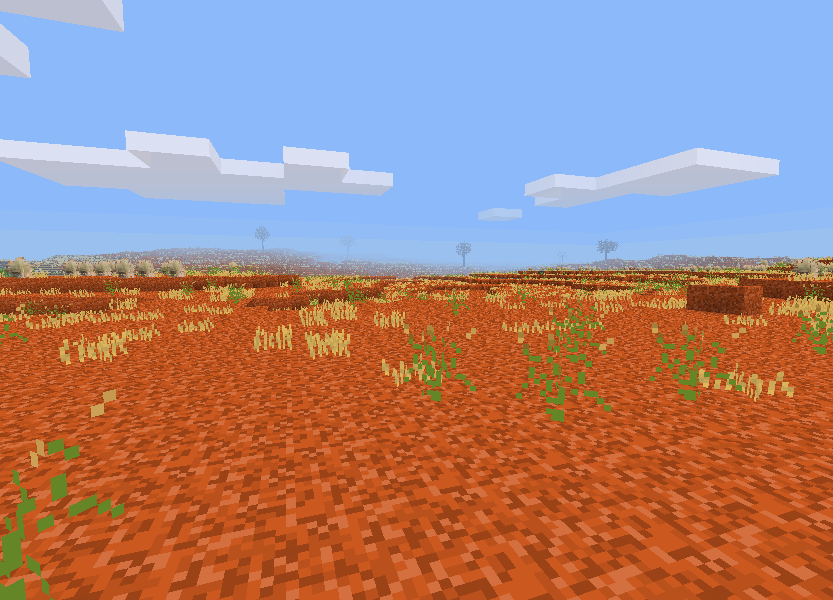

# Australia - Aussieforks edition
Original mod created by vlapsley, updated for Minetest v5.5.1 by Josselin2.
Maintained by Aussieforks (Blockhead/Montandalar and Maverick2797)

[Discussion on Minetest Forums](https://forum.minetest.net/viewtopic.php?f=9&t=14412)

## Inspiration
The inspiration for this mod is my home country, Australia.
I've tried to bring the landscape and flora into the game of Minetest.
Enjoy and think of visiting Australia next time you travel abroad.

### Biomes
#### Underground
Stone. No change from the default game.
#### Mangroves
The mangroves of Queensland and Northern Territory. Watch out for crocodiles!
#### Tasman Sea
Beautiful sandy beaches. You will find lots of Brown and Giant Kelp.
#### Great Australian Bight
Sandstone cliffs and wild ocean.
#### Indian Ocean
Sandy beaches and dolphins.
#### Great Barrier Reef
The most amazing coral reef off the coast of Queensland.
#### Timor Sea
White sand beaches and palm trees.
#### Jarrah-Karri Forest
The south-west corner of Western Australia. Forests of Jarrah, Karri and Marri.
#### Eastern Coasts
Amazing beaches, the dazzling Illawarra Flame Tree in your garden, and a monstrous Moreton Bay Fig to pick fruit from.
The east coast of Australia is the perfect place to build your holiday house.
#### Goldfields-Esperence
Hot, dry and lots of nothing in the center and south of Western Australia.
Except gold. Lots of gold.
#### Arnhem Land
Tropical wetlands in the Northern Territory.
#### Gulf of Carpentaria
Sub-tropical area between Cape York in Queensland and Darwin in the Northern Territory.
#### Far North Queensland
You'll find the tropical Daintree rainforest near the coastline and eucalypt forests inland along the Cape York Peninsula.
#### Pilbara
One of the hottest parts of Australia is the north-west of Western Australia.
The rocky, gravel surface is red due to the amount of hematite in the ground.
You'll find lots of iron ore here. Don't forget to bring plenty of water.
### Kimberley
The north-west of Western Australia is where you'll find the odd-shaped Boab Tree.
Is it the flora or the chance of diamonds that brought you here?
#### Tasmania
The island of Tasmania is the most mountainous state in Australia.
Much of Tasmania is densely forested.
The Tarkine, located in island's far North West, is the largest temperate rainforest area in Australia.
In the south you'll find the tallest flowering tree in the world, Eucalyptus Regnans, the Swamp Gum.
#### Great Dividing Range
The Great Dividing Range is Australia's most substantial mountain range.
The range stretches more than 3,500 km (2,175 mi), running the entire length of the eastern coastline.
#### Victorian Forests
The cool mountains and southern, central and north-eastern Victoria are dominated by wet eucalypt forests.
Blue Gum, White Box and Swamp Gum will all tower over you.
#### Flinders-Lofty
The Flinders-Lofty bioregion in South Australia has a general pattern of mountain ranges, ridges and wide, flat plains.
Some of Australia's best wines come from this region.
#### Murray-Darling Basin
The Murray–Darling basin is a large geographical area in the interior of southeastern Australia.
Its name is derived from its two major rivers, the Murray River and the Darling River.
River Red Gum are know to drop large branches, so watch your head when resting in their shade.
#### Mulga Lands
The Mulga Lands are a bioregion of eastern Australia consisting of dry sandy plains scattered with mulga trees.
#### Central Australia
Central Australia, the 'Red Centre', is the place where you will find the most famous monolith, Uluru and it is where the heart of the outback beats.
#### Simpson Desert
The area is extremely hot and dry. Famous for it's red sand dunes.
#### Australian Alps
The highest parts of the Great Dividing Range.

## To-do list
* Redo some tree textures, especially wood. Some of them are great, some are awful.
* Opals in Central Australia biome.
* Work out way to place some trees and plants along rivers.
* Salt lakes in Central Australia biome.
* Adjust tree and plant distribution.
* Adjust tree size and leaf functions.
* Add some rocky beaches.
* Add some river/lake plants, especially to Arnhem land biome.
* Add terra rossa soil and grape vines in the Flinders-Lofty biome. Red/white wine.
* Add more logs.
* Add moss on trees.
* Palm trees in FNQ and Arnhem land beaches.
* Add support for survival mod/game.
* Add support for a mobs mod - Great White Shark, Tiger Shark, Saltwater Crocodile, Brown Snake, Tiger Snake, Emu, Kangaroo.

## Installation

### Download
1. [Download](https://github.com/vlapsley/australia/archive/master.zip) the .zip file
2. Extract the .zip archive with an archive manager (WinZip, 7-zip, gunzip...)
3. Rename the directory to *australia* and place it in the `/mods` directory of Minetest.

### Download using Git
1. Open the terminal (in Linux) or the Git shell (in Windows), and set the working directory (the *mods* folder) using `cd` - for example `cd /home/vlapsley/.minetest/mods` or `cd C:\Users\vlapsley\minetest-0.4.13\mods`.
2. Clone (download) Australia: `git clone https://github.com/vlapsley/australia.git`.
3. Next time, you can automatically update Australia mod with the same `cd` command, and `git pull origin master`.

## Use
### Mapgen compatibility
The Australia mod has been designed specifically for the Valleys mapgen, currently in Minetest 0.4.14.
It will work with mapgens v5, v7, flat and fractal, but it won't be as visually appealing.
The rivers and temperature/humidity of the Valleys mapgen play a vital role in getting the feel of the Australia mod just right.

### Settings
You can enable/disable biomes by opening the *init.lua* file and changing each biome setting to `1` for enabled or `0` for disabled.
This will also disable plants, trees and more that are unique to that biome.
All biomes are enabled by default. Currently, disabling the *Underground* biome will have no effect.

## Changelog

### 0.5.2
* Internally, trees, corals, kelps and sponges now all use nodetimers and LBMs
instead of ABMs, plus other changes below.

#### Trees

* Trees' growth rate is now scaled by their volume. Bigger trees grow slower
than smaller trees, at a bias for smaller trees.

#### Aquatic Life

* Aquatic life growth now ranges from 60 to 1600 seconds, based on available
light.
* Sponges can now be crafted into ethereal sponge nodes if that mod is present.
* Aquatic life will now only spawn on the top layer of sand(stone) in the ocean.
* Aquatic life-growing stone nodes now appear in the creative inventory

#### Kelp

* Kelp death behaviour has been reworked. The plant will enter a dried up state
instead of just being destroyed if it cannot get any water.
* Destroying a node of tall kelp will now cause every node above it to fall in a
slow cascade.

#### Coral

* Hammer coral is a hard coral and so has been made to act like one instead of a
soft coral as before.
dependency.
* Corals will now bleach rather than disappear entirely if not kept under water
long enough. Coral spawning stones will revert to stone when dying. Watch out!
Stepping on dead coral will hurt.
* Corals will no longer heal players and other entities inside them for no
apparent reason.
* Brain coral now appears in the inventory with its shape visible instead of as
a flat texture.

### 0.5.1

* Australian trees now finally support leaf decay.
* A new series of commands will let server operators spawn aus schematics.
* Fixed sapling drops for fern trees.

### 0.5.0

* Biomes and several other mapgen features can now be disabled via the in-game
settings menu instead of by editing Lua files.
* Added better compatibility for non-valleys mapgens. Valleys mapgen will have
the same height limits as before. Other mapgens will now limit the height of
biomes so that the Australian Alps biome will always generate above a set point
(configurable). This will ensure you can still get snow.
* Muddy river water is no longer renewable because normal river water is not,
and because having it be renewable causes terrible flooding issues on valleys
mapgen.
* Added group:seed items as loot to shipwreck chests so that you can start
European agriculture. This will let you find all the crops from a mod like
Farming Redo as well.
	* Shipwreck loot is now reliably generatable - you will always get the same
	loot for the same ship in the same world seed.
* Refactored tree schematic code to not generate each tree multiple times for
each biome, and refactored tree generation.
    * As a result, fixed a bug that meant Coolabah trees would only spawn in
    Central Australia.
	* Fixed the bug where a node of a tree's trunk would generate at the very
	top of the tree, above the leaves.
	* Trees will now always generate the same schematics with reliable
	randomness based on the tree type, adn cache them in your world.
	* Add fruit lower down on cherry trees
	* Add more height variation to Fan Palms.
	* Stop Merbau trees having floating crowns. Added a bit more height to
	Merbaus so they still dominate over the top of Fan Palms.
	* Some mangrove trees will be one node taller, making the area slightly more
	navigable by boat for instance.
* Refactored grass decoration code to reduce lines of copy-pasted code.

### 0.4.1 (2022-06-29) Josselin2's update

As of 28 June 2022, the original version of this mod produced a number of
annoying errors/warnings on Minetest v5.5.1. Josselin2 updated the code to fix
them.

All changes were preceded by '@@@ Josselin2'. These are occasionally being
removed because they are recorded here and in the git log and there is no
purpose preserving bad old versions of code.

*mod.conf*

Merged in *depends.txt*, and then deleted *depends.txt*

*biome_indian_ocean.lua*

Removed the duplicate brown kelp ABM (biome_great_australian_bight.lua already provides it)

*biome_eastern_coasts.lua*

The Warratah schematic generates an "incorrect number of nodes provided in raw schematic data" error. Fixed it

*biome_flinders_lofty.lua*

The cherry tree was placed in a different biome. This is surely a mistake, so modified it to be placed in the Flinders Lofty biome

Fixed river red gum tree log decoration, which was placed on a non-existent node

*biome_goldfields_esperence.lua*

For backwards compatibility, did *not* fix the typo (it should be Esperance)

*biome_murray_darling_basin.lua*

Fixed river red gum tree log decoration, which was placed on a non-existent node

*biome_pilbara.lua*

In the iron ore definition, changed the ore to iron (instead of "air", which is surely a mistake)

*biome_tasman_sea.lua*

Removed the duplicate brown kelp ABM (biome_great_australian_bight.lua already provides it)

*biome_tasmania.lua*

Fixed typo in the brown mushroom decoration

*biome_victorian_forests.lua*

Fixed typo in the brown mushroom decoration

*noairblocks.lua*

Replaced 'water.alpha = 0' with 'water.use_texture_alpha = "opaque"'

*nodes.lua*

Fixed invalid fields for .inventory_image and .wield_image in several nodes

Fixed typos, climable > climbable, treespaling > treesapling

Replaced 'alpha = 224' with 'use_texture_alpha = "blend"'

Added 'use_texture_alpha = "clip"' to a number of nodes

The mangrove palm had the .description "Mangrove Fern", but there is a separate mangrove fern item. Changed the descriptions

Changed the .description of the submarine chest to "U-Boat" (from U-boot) because most Australians don't speak German as their native language

Removed "australia:fern" and "australia:small_fern" from the not_in_creative_inventory group; it looks like a copy and paste error

*saplings.lua*

Fixed non-existent schematic list, "aus.schematics.river_oak_tree" (should be
"aus.schematics.river_oak_big_tree", matching "aus.schematics.coast_banksia_big_tree")

*README.md*

Replaced the URL to the screenshot

The rest of this file comprises the original README text.

### 0.4 (2016-05-24)
* Added new corals and sea grass.
* Replaced coral sand with coral stone.
* Added sunken woodships and submarines with variable "loot".
* Fixed an issue with the rainforest tree schematic causing Minetest 0.4.14 to crash on startup.

### 0.3.1 (2016-04-22)
* Changed ore distribution to use minetest.register_ore function.
* Added uranium in two biomes if technic_worldgen mod is enabled.
* Added 4 new corals to the Great Barrier Reef biome.
* Added Brown and Giant Kelp to some ocean biomes.
* Changed muddy river water opacity. It's now much harder to see underwater in these rivers.
* Removed necessity to use voxel manipulator, voxel.lua file.
* Fixed noairblocks.
* Fixed a naming issue with some fern textures, credit: Napiophelios.

### 0.2 (2016-04-13)
* Added ferns.
* Fixed muddy water bucket.

### 0.1 (2016-04-11)
* 24 biomes
* 6 new stone nodes, 4 non-stone nodes
* Dirty river water
* 48 trees
* 10 plants
* 4 corals

## Credits
### Code
* Original tree code adapted from Gael-de-Sailly [GNU GPLv3](http://www.gnu.org/licenses/gpl-3.0.en.html), original source can be found at  and duane-r [BSD license](https://en.wikipedia.org/wiki/Bsd_license).
* Original tree schematic creation code modified by vlapsley and orginal by duane-r [BSD license](https://en.wikipedia.org/wiki/Bsd_license).
* noairblocks.lua : Older versions used code modified from Duane Robertson's [valleys_c](https://github.com/duane-r/valleys_c) mod. Original code modified from Perttu Ahola's [noairblocks](https://forum.minetest.net/viewtopic.php?id=4627) mod and released as [LGPL 2.1](http://www.gnu.org/licenses/old-licenses/lgpl-2.1.en.html).
* Sunken woodship and submarine code modified by vlapsley and original copyright (C) 2011-2012 by celeron55, Perttu Ahola <celeron55@gmail.com>, (https://creativecommons.org/licenses/by-sa/3.0/legalcode)   [GNU Lesser General Public License](http://www.gnu.org/licenses/old-licenses/lgpl-2.1.en.html) as published by the Free Software Foundation; either version 2.1 of the License, or (at your option) any later version.

### Sounds
* [Mangrove mud](http://www.freesound.org/people/dobroide/sounds/16771) copyright (C) 2006 by dobroide, [CC by 3.0](https://creativecommons.org/licenses/by/3.0/legalcode)

### Textures
* Moss textures by Neuromancer, [WTFPL](https://en.wikipedia.org/wiki/WTFPL).
* Fern textures by Mossmanikin, [WTFPL](https://en.wikipedia.org/wiki/WTFPL).
* Giant Kelp textures copyright (C) 2012 by celeron55, Perttu Ahola, [CC BY-SA 3.0](https://creativecommons.org/licenses/by-sa/3.0/legalcode).
* Textures from Minetest Game, Attribution-ShareAlike 3.0 Unported (CC BY-SA 3.0), http://creativecommons.org/licenses/by-sa/3.0/
* All other textures by demon_boy [github](https://github.com/vlapsley), Attribution-ShareAlike 3.0 Unported (CC BY-SA 3.0), http://creativecommons.org/licenses/by-sa/3.0/
